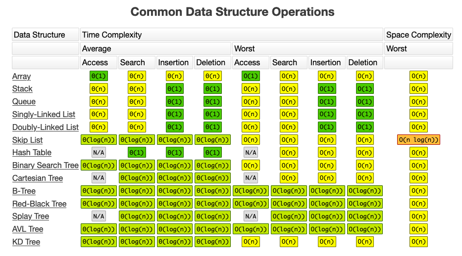

  

## Table of Contents

- [What is the Big O?](#what-is-the-big-o)
- [Techniques](#techniques)

Extra Important Official References

- [What is Big O Notation Explained: Space and Time Complexity](https://www.freecodecamp.org/news/big-o-notation-why-it-matters-and-why-it-doesnt-1674cfa8a23c/)
- [Learn Big O Notation In 12 Minutes](https://drive.google.com/file/d/1oad1yMHhsvL0hrxSY5hr5hl2YUqmn6o1/view?usp=drive_link)

# What is the Big O?

A common phrase used for this notation is: _"How code slows as data grows"_

It's the notation used to describe the performance of an algorithm as the amount
of data increases.

This notation is machine independent. What we are really focusing on is the number of steps to complete and algorithm as we tend to ignore smaller operations (e.g. O(n+1) -> O(n)).

Time is not the only important factor when analyzing an algorithm. The amount of
memory used can also be highly relevant. Typically, trade-offs are made between
time complexity and space complexity, as improving one often leads to worsening
the other.

Therefore, the goal is to find a good balance between the two complexities and
choose the one that best suits our needs, given our specific conditions.

### Time & Space complexities

   

The **worst** and **average** cases in the chart refer to how algorithms perform under different scenarios, specifically:

_Worst Case_

- Describes the maximum amount of time or space the algorithm will take for the largest and most difficult input.
- This case represents the upper limit of the algorithm's performance.
- Used to guarantee that the algorithm will not exceed a specific time or space limit.

  Examples:

  1.  Searching for an element in an unsorted array that doesn't exist (linear search: O(n)O(n)).
  2.  A quicksort where the pivot always splits the array poorly (worst case: O(n2)O(n2)).

_Average Case_

- Describes the expected performance of the algorithm over a variety of typical inputs.
- It represents the behavior of the algorithm in real-world usage scenarios.
- Assumes all inputs are equally likely (unless stated otherwise).

  Examples:

  - Searching for a random element in an unsorted array (linear search: O(n)O(n)).
  - A quicksort where the pivot splits the array evenly most of the time (average case: O(nlog⁡n)O(nlogn)).

_Key Points_

- Worst Case helps understand the limits of the algorithm and is useful for performance guarantees.
- Average Case gives a more practical estimate of how the algorithm performs for most inputs.

# Techniques

## Two Pointers

Get an undertanding of the technique by taking a look at these resources:

- [AlgoMaster Newsletter - Two Pointers](https://blog.algomaster.io/p/69025a2e-b0d5-4705-8507-bba16c2691f1)
- [YouTube - How to Use the Two Pointer Technique](https://www.youtube.com/watch?v=-gjxg6Pln50)

### General Indicators to use it:

The **Two Pointers** technique is a problem-solving strategy where two pointers (or indices) traverse an array (or string) in a specific way to solve the problem efficiently. These pointers can move toward each other, away from each other, or independently, depending on the problem requirements.

Here are the primary contexts where the Two Pointers technique shines:

1. **Non-Contiguous Relationships**

   The problem involves finding a relationship between two numbers, characters, or elements that don’t have to be contiguous.

   For example:

   - Finding two numbers in an array whose sum equals a target.
   - Comparing elements from two separate arrays or strings.

2. **Sorted Input**

   The input array (or string) is sorted. This is common for problems involving sums, differences, or ranges, as sorting helps simplify the traversal logic.

   For example:

   - Pair with a target sum.
   - Counting pairs with a specific difference.

3. **Converging or Diverging Pointers**

   The solution requires traversing from opposite ends of the array toward the center (converging), or from one pointer catching up to another (diverging).

4. **Optimization Over Brute Force**

   The problem has a brute-force solution involving O(n2)O(n2) nested loops, but a more efficient O(n)O(n) or O(nlog⁡n)O(nlogn) solution is possible using Two Pointers.

### Common Problem Types That Use Two Pointers

1.  **Pair or Triplet Problems**

    - Finding a pair of elements with a specific sum, product, or difference.
    - Finding three numbers (triplets) in an array that satisfy a condition (e.g., three numbers summing to zero).

2.  **Merging or Comparing**

    - Merging two sorted arrays.
    - Comparing elements between two strings or arrays for commonalities or differences.

3.  Partitioning or Rearranging

    - Rearranging elements in an array (e.g., moving zeros to the end, separating even and odd numbers).
    - Partitioning an array based on a pivot.

4.  **Geometry or Range-Based Problems**
    - Problems involving a "window" of values but without contiguity constraints (e.g., Trapping Rainwater).

### How to Identify Two Pointers Problems

Ask yourself these questions:

_Does the problem involve finding relationships between pairs or groups of elements?_

- E.g., sum, difference, or product of two numbers.

_Is the input sorted or can it be sorted?_

- Many Two Pointers problems assume sorted input for efficiency.

_Can we solve the problem by traversing the array with two indices instead of using nested loops?_

- If yes, Two Pointers is a likely fit.

_Does moving one or both pointers help achieve the solution?_

- E.g., moving one pointer increases or decreases the value we're analyzing.

### When Two Pointers Doesn't Work

- Input is Not Sorted (or Can't Be Sorted)

  - Two Pointers often requires a sorted array, but sorting may not be allowed due to constraints.

- Problem Requires Non-Pairwise Relationships

  - Problems like finding subsets or permutations need other techniques like Backtracking or Dynamic Programming.

- Elements Are Not Comparable

  - If the elements cannot be compared (e.g., complex objects), Two Pointers is not applicable.

- Order of Elements Matters

  - If the solution depends on maintaining the original order of elements, sorting (needed for Two Pointers) won't work.

- Problems Involving Non-Array Data Structures

  - Two Pointers works on arrays or strings, not graphs, trees, or linked lists.

- Global Constraints or Counting Needed

  - Counting all valid pairs or analyzing global properties may require Hash Maps or other approaches.

- Incremental Movements Are Ineffective

  - If the problem requires analyzing all combinations (e.g., brute force), Two Pointers won’t help.

## Sliding Window

Get an undertanding of the technique by taking a look at these resources:

- [AlgoMaster Newsletter - Sliding Window](https://blog.algomaster.io/p/f4412a17-7a3a-4d0b-8e39-9ea8f429bf7c)
- [YouTube - How to Use the Sliding Window Technique](https://youtu.be/dOonV4byDEg?si=CJCyuP4gMp1lz8x0)

### General Indicators to use it:

The **Sliding Window** technique is useful when dealing with problems that involve **contiguous subarrays or substrings**, and when optimizing a brute-force solution is necessary. Below are **general indicators** that suggest the Sliding Window technique might be a good fit:

1. **Contiguous Subarrays or Substrings**

   The problem explicitly requires finding or analyzing properties of a contiguous portion of an array or string.

   Examples:

   - Find the maximum sum of a subarray of size kk.
   - Find the length of the smallest subarray whose sum is greater than or equal to ss.
   - Find all substrings of length kk with unique characters.

2. **Fixed or Variable Window Size**

- The window size is either fixed (e.g., subarray size kk) or variable (e.g., increase or shrink dynamically based on conditions).

  _Fixed Window Example:_

  - Find the average of all subarrays of size kk.

  _Variable Window Example:_

- Find the smallest subarray with a sum greater than or equal to ss.

3. **Optimization Over Brute Force**

   - A brute-force solution involves nested loops to calculate the desired property for every possible subarray or substring, resulting in O(n2)O(n2) or worse time complexity.

   - Sliding Window reduces this complexity by reusing results from the previous window, often achieving O(n)O(n).

   Example:

   Instead of recalculating the sum of a subarray from scratch, you can adjust the sum incrementally as the window slides.

4. **Problems Involving Cumulative Properties**

   Sliding Window works well for problems where you are calculating properties like:

   - Sum
   - Product
   - Maximum/Minimum
   - Frequency of elements
   - Number of distinct characters

5. **Shrinking the Window Based on Conditions**

   If the problem involves dynamic constraints (e.g., "smallest subarray" or "longest substring without repeating characters"), Sliding Window allows you to adjust the window size by moving the start and/or end pointers.

   Example:

   - Find the longest substring without repeating characters: Use a hash set to track characters and slide the window by removing characters from the start when a duplicate is found.

### Common Problem Types That Use Sliding Window:

_Maximum or Minimum Values:_

- Find the maximum sum of a subarray of size kk.
- Find the maximum product of a subarray of size kk.

_Count or Length:_

- Find the length of the longest substring with at most kk distinct characters.
- Find the smallest subarray with a sum greater than ss.

_Character/Element Frequency:_

- Find the longest substring without repeating characters.
- Find all anagrams of a string in another string.

### How to Identify Sliding Window Problems

Ask yourself these questions:

_Does the problem involve contiguous subarrays or substrings?_

- If yes, Sliding Window is likely applicable.

_Does the problem require optimization over a brute-force solution?_

- If the brute force involves recalculating properties for overlapping subarrays, Sliding Window can help.

_Can I maintain the required information incrementally as the window moves?_

- For example, maintaining a sum, a count, or a frequency map.

### When Sliding Window Doesn't Work

- If the elements you are analyzing are not contiguous (e.g., finding a pair of numbers in an array that sum to a target).
- If the problem involves combinations, permutations, or other non-contiguous subsets (other techniques like Two Pointers or Dynamic Programming might be better).

## Prefix Sum

Get an undertanding of the technique by taking a look at these resources:

- [Prefix Sum Array And Range Sum Queries](https://drive.google.com/file/d/1GKyMyo6JjgeWvZIem8eKn8WEPCrTyxE8/view?usp=drive_link)
- [YouTube - Prefix Sum in 4 minutes | LeetCode Pattern](https://www.youtube.com/watch?v=yuws7YK0Yng)

### General Indicators to use it:

The **Prefix Sum** technique is a fundamental concept in computer science, particularly useful for problems involving cumulative sums or differences. By preprocessing an array into a prefix sum array, you can efficiently query the sum of elements in a given range or solve other related problems.

The prefix sum array is an auxiliary array where each element at index i contains the cumulative sum of the original array elements from the start up to index i.

_Prefix Sum Array Formula:_

- prefix[i] = prefix[i-1] + arr[i] (for i > 0)
- prefix[0] = arr[0]

This preprocessing allows you to calculate the sum of elements in a range [l, r] efficiently.

_Range Sum Formula:_

- sum[l, r] = prefix[r] - prefix[l-1] (for l > 0)
- sum[0, r] = prefix[r] (for l = 0)

The **Prefix Sum** technique is applicable in scenarios where:

1. **Sum of Subarrays:**

- The problem involves finding the sum of elements in one or multiple subarrays quickly.
- Example: Find the sum of elements in multiple ranges.

2. **Cumulative Analysis:**

- You need to analyze cumulative properties like sums or averages over a sequence.
- Example: Determine the average of elements in a range.

3. **Optimization Over Brute Force:**

- A naive approach recalculates the sum of a range repeatedly, leading to O(n2)O(n2) complexity for multiple queries.
- Prefix Sum reduces it to O(n)O(n) preprocessing and O(1)O(1) per query.

4. **Difference Arrays:**

- If you need to perform incremental updates over a range and query cumulative effects, prefix sums can help.

### When Prefix Sum Doesn't Work

- When the problem involves dynamic updates (e.g., changing an element in the array). Fenwick Trees or Segment Trees are better suited.
- When the problem involves non-cumulative properties, like finding the maximum or minimum element in a range.

### KEY DIFFERENCES

| **Aspect**              | **Sliding Window**                                         | **Two Pointers**                                                          | **Prefix Sum**                                                            |
| ----------------------- | ---------------------------------------------------------- | ------------------------------------------------------------------------- | ------------------------------------------------------------------------- |
| **Contiguous Elements** | Always works with contiguous subarrays/substrings.         | Not limited to contiguous elements, focuses on conditions.                | Typically works with contiguous subarrays, leveraging cumulative sums.    |
| **Primary Use Case**    | Problems involving subarrays/substrings (e.g., sum, max).  | Problems involving pairs or specific relationships (e.g., sum to target). | Problems involving range sums or quickly calculating sums over subarrays. |
| **Window Size**         | Uses a fixed or dynamically adjusted window.               | Typically no window; uses two pointers that move independently.           | No window, relies on cumulative sums over the array.                      |
| **Efficiency**          | Eliminates redundant calculations for subarrays.           | Works efficiently on sorted data by converging pointers.                  | Precomputes sums in \(O(n)\), allowing \(O(1)\) range sum queries.        |
| **Common Examples**     | Maximum sum subarray, smallest subarray with sum ≥ target. | Pair of numbers with sum equal to a target, trapping rainwater.           | Range sum queries, subarray sum equals target, difference arrays.         |
